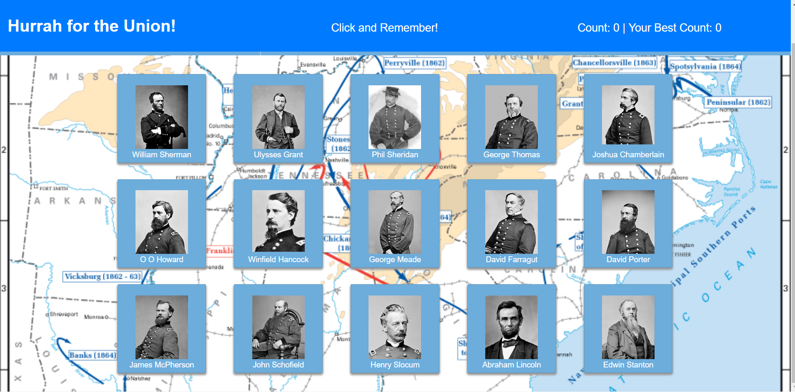

# Hurrah for the Union!

## What the project does
This is an implementation of the Clicky Game, done as homework for the February 2018 UNC Coding Boot Camp. Here's a screen cap:

## How to get started with the game
Hurrah for the Union was completed during the week of Independence Day. A game of memory, it seeks to recall leaders of the bloody struggle to keep the United States whole and free the slaves. The name comes from the lyrics of a popular song of the day.

The game is simplicity itself. There are 15 cards showing the pictures and names of important Union leaders during the Civil War. The goal is to click each of them once, and only once. If you click a card a second time, the game resets and you have to start from zero again.

The name of each leader is also a hyperlink to his Wikipedia page. If you don't know these men and have an interest in American history, they're worth checking out.

## Authors
Hurrah for the Union was built and will be maintained by Mark Hainline. Help should not be needed, and will not be available.
